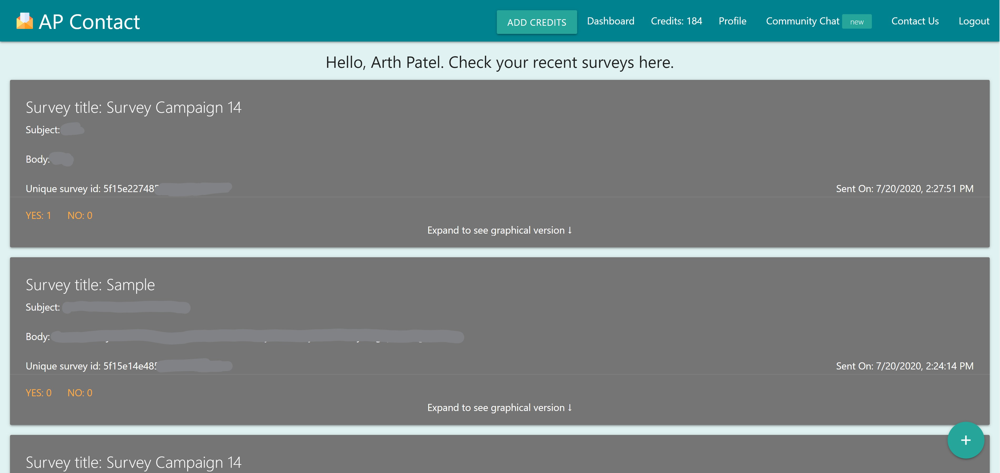

# Email Survey App

Email Survey App is an web application built using the MERN stack for dealing with sending some business survey email and then further tracking the customer responses from the email using webhooks on a custom dynamic user dashboard. [Check out the Demo](https://sheltered-oasis-38500.herokuapp.com/).

## Built with

1. [Node JS](https://nodejs.org/en/)
2. [React JS](https://reactjs.org/)
3. [Express JS](https://expressjs.com/)
4. [Mongo DB](https://www.mongodb.com/)

And several included dependencies in the _package.json_ file.

## Screenshots



## Installation

Use the package manager _npm_ to install Email Survey App.

```npm
> cd email-surveys
# For the root directory
> npm install 
# For the client directory
> cd client 
> npm install 
```

## Preparatory run step

Under the config folder, add a file called _dev.js_.

Copy the file content from prod.js to the newly created file - dev.js.

Get your MongoDB connection string and paste them in place of the appropriate environment variable.

Also get your API keys from Google OAuth, Sendgrid, and Stripe. Paste all those keys in place of the respective environment variables in dev.js file.

## Run the App

```npm

# Following will run both client and server side apps.
> npm run dev 

```

## Contributing
Pull requests are welcome. For major changes, please open an issue first to discuss what you would like to change.

Please make sure to update tests as appropriate.

## License
[MIT](https://en.wikipedia.org/wiki/MIT_License) (c) 2020 Arth Patel
